# JRNY Lovable Projects Audit
**Date:** 21 April 2026  
**Auditor:** POS (CFO Agent)  
**Purpose:** Full audit of Pete's Lovable projects for JRNY platform architecture alignment  
**Total projects:** 20  
**Verdict summary:** 9 INTEGRATE · 2 REBRAND · 3 KEEP-SEPARATE · 6 KILL

---

## 🔴 TL;DR for Pete

**The good news:** You have a nearly complete JRNY stack sitting in Lovable. The core consumer booking UI (Brisbane Explorer + hop-on-hop-off), the event transfer product (jrny-event-rover), the operator portal (HOHO Partner Portal), and the planning layer (translink-journey-map + qld-route-adventures) are all built and functional. 

**The action:** Ship 5 of these as JRNY.au for May 1 soft launch. Archive the 6 kill candidates. The code is already in GitHub — you can cancel/downgrade Lovable now.

---

## Projects Audit

### 1. Route Intelligence Hub
- **URL:** https://route-spark-forge.lovable.app
- **What it is:** "Explore Experiences" — a marketplace showing tour experience cards with pricing, star ratings, and "Book Now" buttons
- **Key features:** Grid layout, experience cards with images, pricing badges, category filtering
- **JRNY Verdict:** ✅ INTEGRATE — **Discovery → Booking layer**. Already JRNY-branded. This is the consumer-facing product catalogue. Slot into jrny.au/explore
- 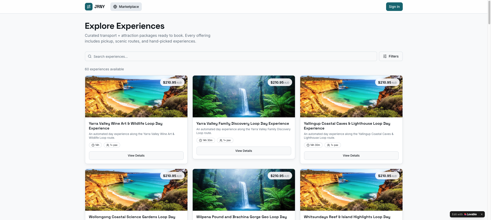

---

### 2. Hopio Investor Hub
- **URL:** https://hopio.com.au
- **What it is:** "hopio — Infrastructure for Tourism Mobility" — a separate investor/B2B brand for the JRNY infrastructure layer
- **Key features:** Hero with bus image, "Register Your Interest" CTA, "What Hopio Does" section (content loading behind dark sections)
- **JRNY Verdict:** 🔵 KEEP-SEPARATE — This is a deliberate strategic brand separation (hopio = infrastructure, JRNY = consumer experience). Keep as the investor/government pitch vehicle. Do not merge into jrny.au.
- 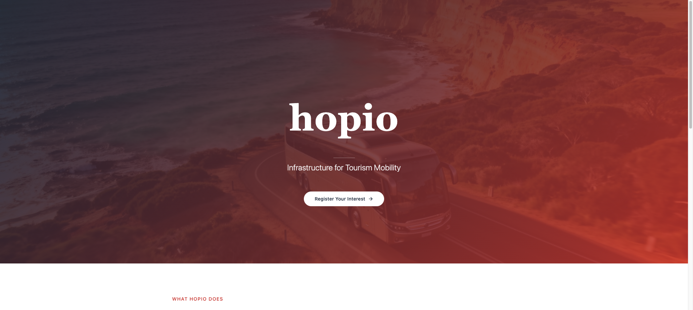

---

### 3. HOHO Partner Portal
- **URL:** https://jrnyau.lovable.app
- **What it is:** "Tourism mobility, connected." — The main JRNY B2B operator acquisition portal with full partner pitch content
- **Key features:** Operator types (Transport/Attractions/Accommodation/Hospitality/Destinations/Agents), Foundation Member intake, problem/solution narrative, PDF packs per operator type, FAQs, live tracking and smart ticketing described
- **JRNY Verdict:** ✅ INTEGRATE — **Operator B2B layer**. This is the crown jewel B2B page. Domain jrnyau.lovable.app should become partners.jrny.au. Move to production ASAP.
- 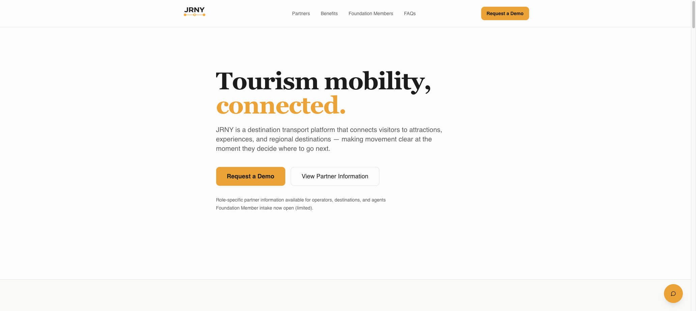

---

### 4. hop-on-hop-off
- **URL:** https://hop-on-hop-off.lovable.app
- **What it is:** Consumer transit app — "Journey Hub" mobile UI with live map showing route stops
- **Key features:** Full-screen map with route overlay, bottom nav bar (Explore / Transit / Bookings / Messaging / Settings), live bus stop dots
- **JRNY Verdict:** ✅ INTEGRATE — **Booking + Live Tracking layer**. This is the consumer mobile app. The "Journey Hub" branding and nav perfectly match JRNY. Slot in as the live day-of-travel interface.
- 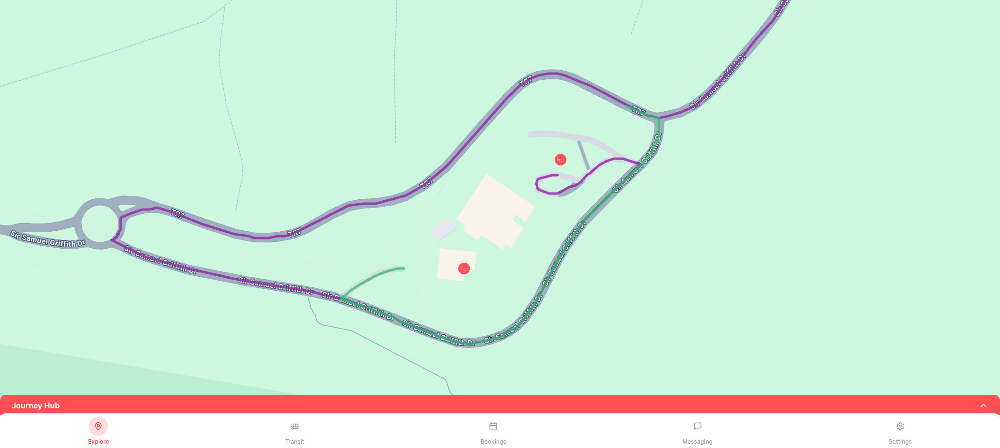

---

### 5. Apex Flow
- **URL:** https://preview--align-pro-ai.lovable.app
- **What it is:** "Continuous Optimisation Engine" — a multi-company B2B KPI/goals dashboard
- **Key features:** CEO Dashboard (multi-company KPI overview), Staff Messenger (daily check-ins), Goals & KPIs tracker, Email Command (auto-classify emails by business goals)
- **JRNY Verdict:** ❌ KILL — No JRNY relevance. This is a general business management SaaS concept. Could be repurposed for PT ops if needed but has zero tourist transport functionality. Archive.
- 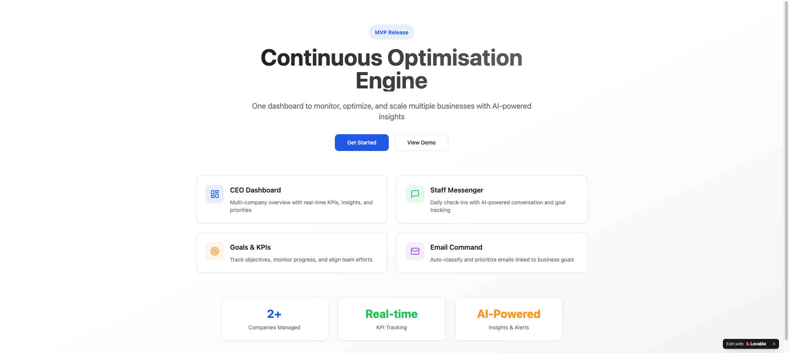

---

### 6. geo-story-hub
- **URL:** https://lovable.dev/projects/b4036e00-1ca1-4c8a-a6a0-b52bff92298f
- **What it is:** A geo-located story/content platform protected behind Supabase auth
- **Key features:** Auth wall (Sign In/Sign Up), requires credentials to access full content — suggests user-generated or curated location-based content
- **JRNY Verdict:** 🔵 KEEP-SEPARATE — Requires auth investigation. Likely an early prototype of JRNY's TikTok-style content discovery layer. Pull the code, review with Lorenz, assess integration path. Don't kill blind.
- 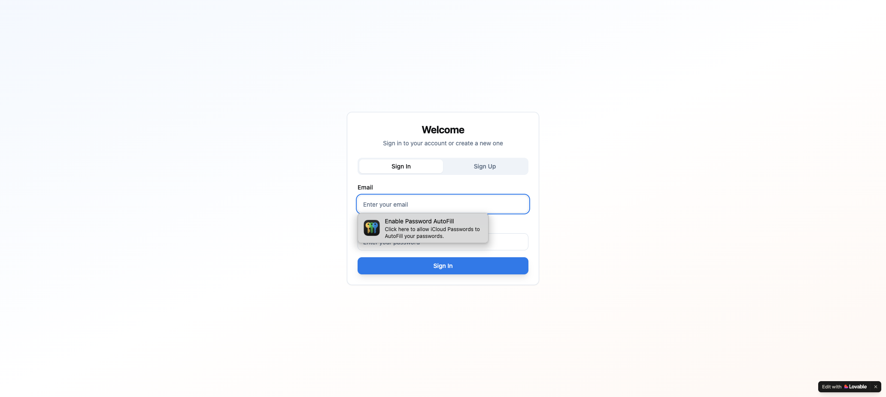

---

### 7. qld-route-adventures
- **URL:** https://preview--qld-route-adventures.lovable.app
- **What it is:** "Queensland Tourism Routes" — interactive route planner based on departure airport
- **Key features:** 8 airport selector buttons (BNE/OOL/MCY/CNS/TSV/MKY/ROK/PPP), Mapbox map integration (needs API key), 50+ destinations, 100+ planned routes
- **JRNY Verdict:** ✅ INTEGRATE — **Discovery layer**. This is exactly Pete's region-adaptive UI vision. Airport = starting intent signal. Show relevant routes/tours based on where visitor arrived.
- 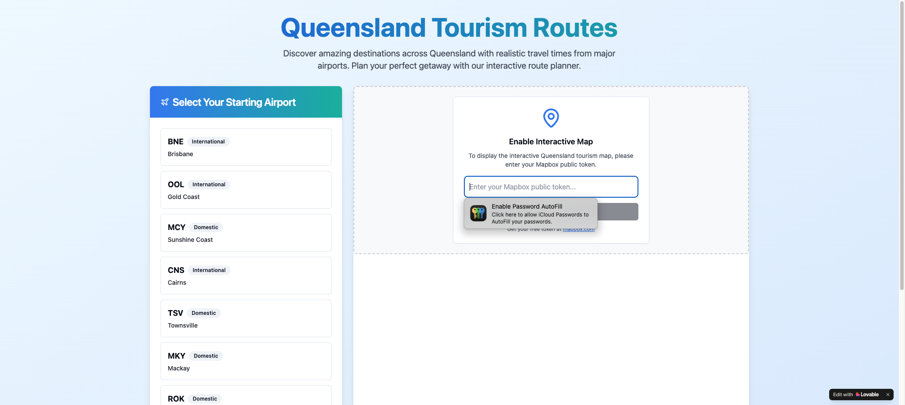

---

### 8. Conversion Catalyst
- **URL:** https://preview--conversion-catalyst.lovable.app
- **What it is:** "Master the Art of Covert Hypnotic Influence" — a "Killer Influence" sales/persuasion course landing page
- **Key features:** 6 course modules (Foundations of Covert Influence, Emotional Trigger Mastery, Covert Hypnotic Language Patterns...), testimonials, 30-day refund guarantee
- **JRNY Verdict:** ❌ KILL — This is a sales course landing page template. Zero JRNY relevance. Archive immediately.
- 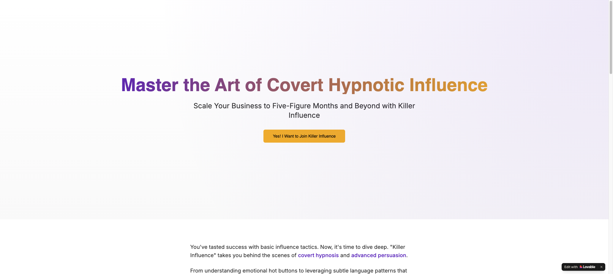

---

### 9. Brisbane Explorer
- **URL:** https://id-preview--ea855a2d-ef13-42f2-a8ef-28362327208e.lovable.app
- **What it is:** "Tour Brisbane | Unforgettable Brisbane & Queensland Experiences" — a full consumer tour discovery and booking platform
- **Key features:** Hero with Brisbane City backdrop, Featured Experiences grid (Island Tours $189, City Tours $79, Nature Tours $149, Wildlife $95), Browse/Search tours, My Bookings, Travel Tips & Guides blog, Stripe payment integration
- **JRNY Verdict:** ✅ INTEGRATE — **Discovery + Booking layer (PRIORITY)**. This is the most complete consumer-facing JRNY product. Full listing + pricing + Stripe. Rebrand to jrny.au/brisbane or deploy as jrny.au. This IS the May 1 MVP.
- 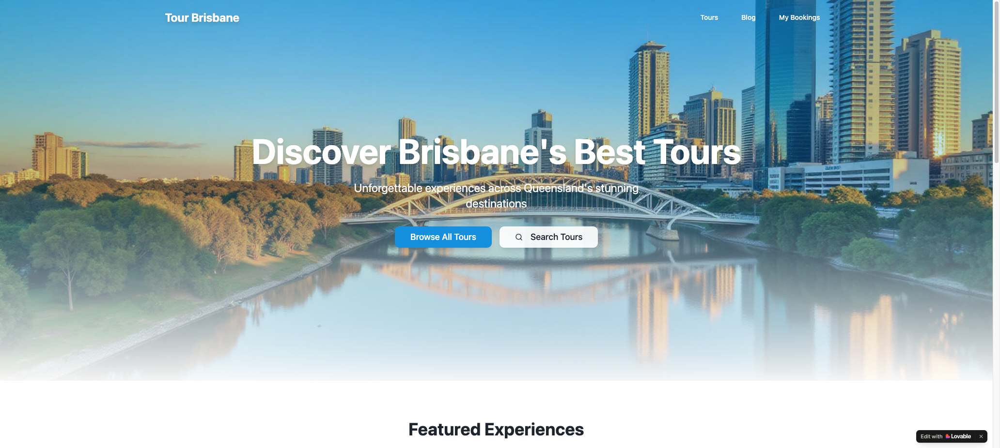

---

### 10. Tour Site Builder
- **URL:** https://id-preview--1cebfc28-dfd5-4128-b22e-cc73d8304ad8.lovable.app
- **What it is:** "GoldCoast Wine Tours" — SEO-optimised microsite structure with 24+ URL paths
- **Key features:** Full Day/Half Day/Private/Group & Event/Luxury Experience tour categories, SEO-optimised URL structure, schema markup, conversion-focused layouts, booking widget integration
- **JRNY Verdict:** ✅ INTEGRATE — **Operator B2B layer**. This is an SEO microsite generator for tour operators. Pineapple Tours could use this as a template to generate their own SEO pages. Hand to Lorenz to build as a Lovable-to-production pipeline for PT SEO.
- 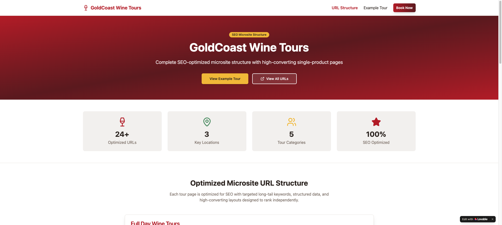

---

### 11. Journey Genie
- **URL:** https://id-preview--ad4b5b67-b945-4f4f-97f8-4209b73b4db5.lovable.app
- **What it is:** "Find Your Perfect Flight" — AI-powered group travel flight booking with airport code search
- **Key features:** Group size selector (1-8+), origin/destination airport search, date picker, cabin class selector, "AI-Powered Travel Intelligence" branding
- **JRNY Verdict:** ✅ INTEGRATE — **Planning layer**. Group flight booking signals inbound tourism demand — who's arriving, when, how many. Could feed into JRNY's arrival-based route intelligence. Integrate as "Getting Here" module.
- 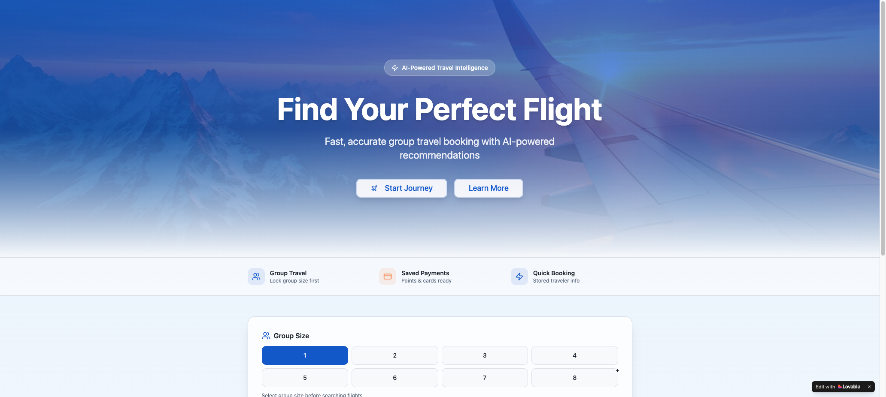

---

### 12. Goal Circle
- **URL:** https://id-preview--2814b5b1-642e-4c7e-b703-1b2447ccbce1.lovable.app
- **What it is:** "GoalSync" — a social goal-tracking app with a social feed of user achievements
- **Key features:** Goals feed (Health, Learning, Family, Travel, Work categories), like/comment buttons, bottom nav (Home/Goals/Create/Chat/Profile)
- **JRNY Verdict:** ❌ KILL — No tourism transport relevance whatsoever. Archive.
- 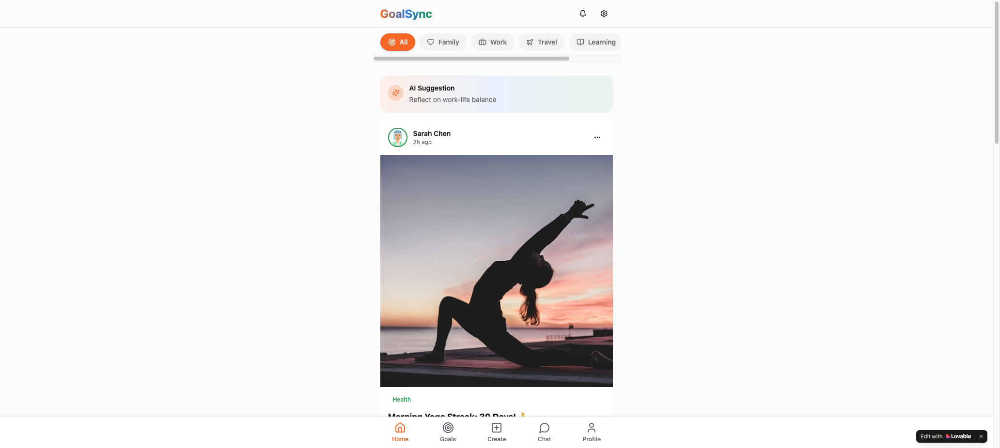

---

### 13. hop-on-template
- **URL:** https://id-preview--85598956-ce7c-4869-a56b-9bcb2cb03e5e.lovable.app
- **What it is:** "CityTours" — a full hop-on hop-off city tour template with route maps, features, and ticket pricing
- **Key features:** 3 routes (Historic City, Waterfront & Parks, Modern District), How It Works flow (Book → Find Stop → Hop On → Explore), 24hr $35 / 48hr $55 / 72hr $70 pass tiers, group discounts, audio guide, free WiFi
- **JRNY Verdict:** 🔄 REBRAND — This is the cleanest HOHO consumer UI of all projects. Rebrand from "CityTours" to JRNY, connect to pineappledash Rezdy/Stripe backend, and launch as jrny.au/hop-on. Strong May 1 candidate.
- 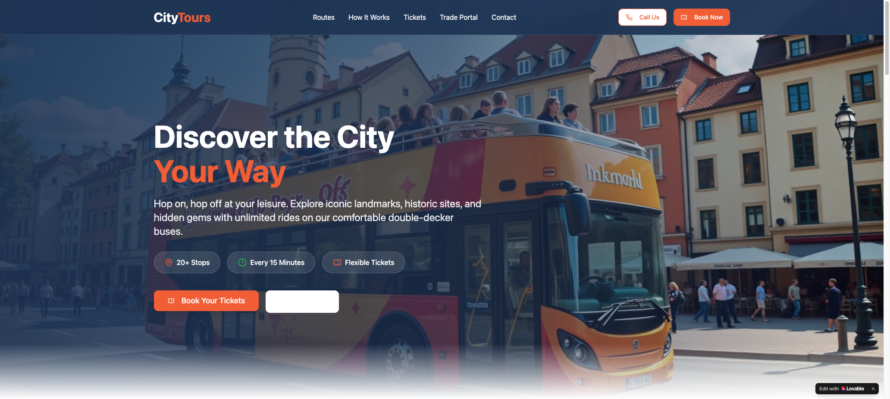

---

### 14. jrny-event-rover
- **URL:** https://id-preview--36f7b6c8-2f24-4fd4-8feb-485556de5043.lovable.app
- **What it is:** "JRNY.AU — Easy event transfers, sorted." — Event transfer booking platform with Rezdy integration
- **Key features:** Filter by category/event keywords/date/adults/children/pickup region, "Brisbane — South Bank" as example, FAQ section, all bookings via Rezdy, serves Brisbane + Gold Coast + Scenic Rim + Tamborine Mountain
- **JRNY Verdict:** ✅ INTEGRATE — **Booking layer (CORE PRODUCT)**. Already JRNY-branded, already uses Rezdy, already covers the right geography. This is the May 1 MVP product. Ship this.
- 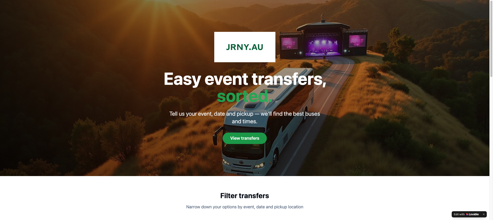

---

### 15. ngali-wander-stories
- **URL:** https://id-preview--9c069923-ef04-4fcb-b67f-c84318fedf98.lovable.app
- **What it is:** An early-stage travel discovery app with indigenous/cultural branding ("Ngali" = likely Aboriginal word for "together/us")
- **Key features:** Location search bar, Explore/Planner/Book/Chat/Profile bottom nav, minimal content loaded (prototype stage)
- **JRNY Verdict:** 🔵 KEEP-SEPARATE — Interesting concept, very early stage. The nav flow (Explore → Planner → Book) perfectly mirrors JRNY's consumer journey. Could become JRNY's indigenous tourism content layer or cultural discovery module. Don't kill. Revisit post-launch.
- 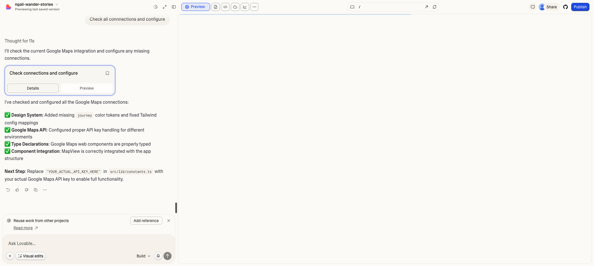

---

### 16. op-on
- **URL:** https://id-preview--0caa1b0d-813e-4639-aee3-9b0fe1dc12a6.lovable.app
- **What it is:** "Hop On Hop Off — Revolutionary Platform Architecture" — a visual platform architecture document
- **Key features:** Supply Side (operators: buses, vans, EVs), AI Orchestration Core (demand forecasting, dynamic routing, dispatch optimization), Demand Side (travellers via app/QR/OTAs, hotels, cruise), Governance/Revenue (25%+ commission, ESG), 5-Phase scaling roadmap (Tamborine → Gold Coast → QLD → National → Global)
- **JRNY Verdict:** 🔵 KEEP-SEPARATE — This is Pete's platform vision turned into a UI. Valuable as a board/investor/partner presentation tool. Not a consumer product. Keep as internal strategic reference.
- 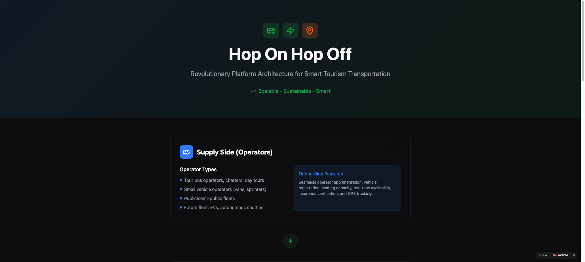

---

### 17. translink-journey-map
- **URL:** https://id-preview--f1be1914-83d6-4b42-b423-d43c14946cf1.lovable.app
- **What it is:** "Queensland Transit Network Map" — interactive GTFS-based public transit visualization
- **Key features:** Toggleable layers (Rail/Bus/Ferry/Custom/Suggested Routes), Mapbox map of SEQ, Drawing Tools (Select/Line/Area), Save/Import Routes, Hotel/Airport/Attraction area overlays, loads Queensland GTFS data
- **JRNY Verdict:** ✅ INTEGRATE — **Planning layer**. This is the route intelligence backbone — knowing where transit exists lets JRNY fill the gaps with tour transport. Hand to Lorenz to connect GTFS data to pineappledash for route planning.
- 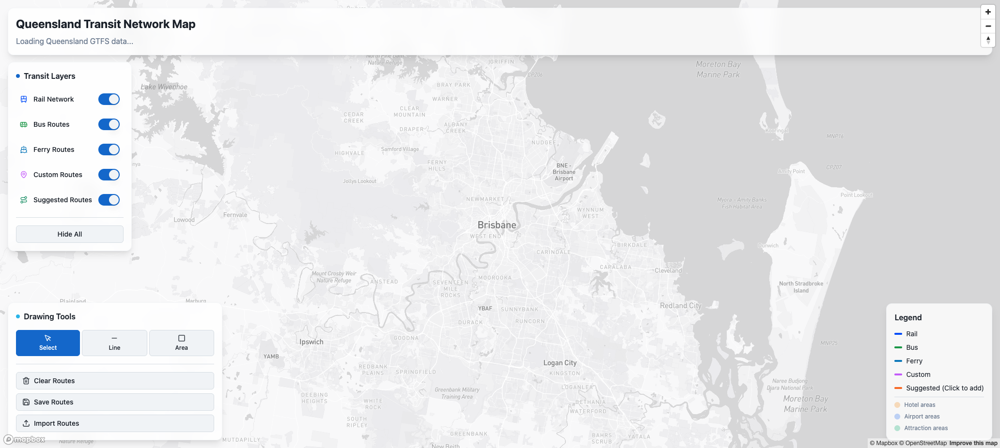

---

### 18. ari-spark-learn
- **URL:** https://id-preview--523aa652-36ce-459e-9344-b4b95143259c.lovable.app
- **What it is:** "ARI Learning Companion" — an adaptive AI educational app for children
- **Key features:** "Adaptive • Responsive • Interactive" tagline, Sign In, "Your AI Learning Companion is ready to start an amazing educational journey with you!"
- **JRNY Verdict:** ❌ KILL (personal project) — Built for Ari Myers (Pete's daughter). Personal, not a business project. Archive.
- 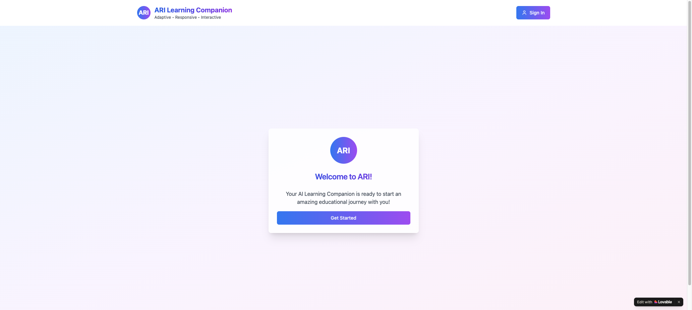

---

### 19. glass-flow-spark
- **URL:** https://id-preview--dabdfcdc-122a-4691-8bc1-da2101e14e18.lovable.app
- **What it is:** "Float OS" — AI-powered productivity and wellness app
- **Key features:** AI Summarizer, Idea Generator, Task Optimizer, Hydration/Mood tracker, Breathing exercises, AI Leaderboard (GPT-4), Focus Calendar, Time Blocks, Goal Progress
- **JRNY Verdict:** ❌ KILL — General productivity SaaS. No tourism relevance. Archive.
- 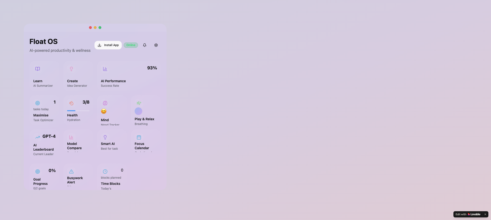

---

### 20. opportunity-alchemy-engine
- **URL:** https://id-preview--72e1f228-e5b3-485e-be9c-f74e75c58b9a.lovable.app
- **What it is:** "Continuous Opportunity Engine" — a business opportunity/CRM tool behind auth
- **Key features:** Login page only visible, Supabase auth, business-focused naming
- **JRNY Verdict:** ❌ KILL — Not enough visible to assess, auth-protected, name suggests general business CRM. No JRNY relevance. Archive.
- 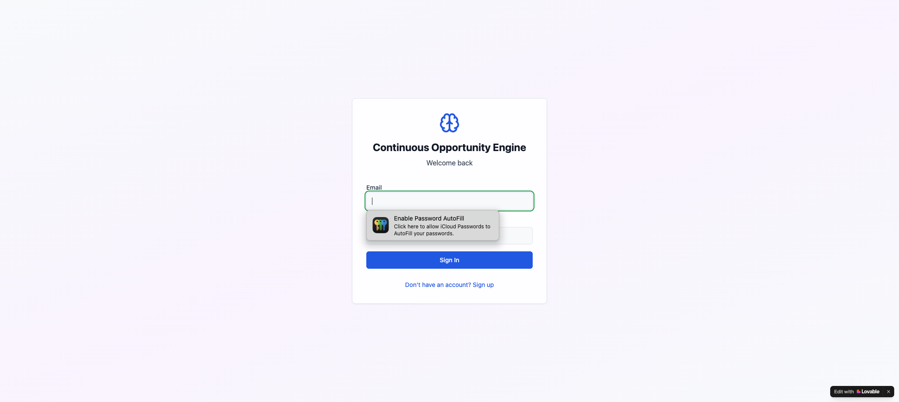

---

## Summary Matrix

| # | Project | Verdict | Layer | Priority |
|---|---------|---------|-------|----------|
| 1 | Route Intelligence Hub | ✅ INTEGRATE | Discovery/Booking | HIGH |
| 2 | Hopio Investor Hub | 🔵 KEEP-SEPARATE | Investor Brand | MEDIUM |
| 3 | HOHO Partner Portal | ✅ INTEGRATE | Operator B2B | HIGH |
| 4 | hop-on-hop-off | ✅ INTEGRATE | Consumer App | HIGH |
| 5 | Apex Flow | ❌ KILL | — | LOW |
| 6 | geo-story-hub | 🔵 KEEP-SEPARATE | Discovery (TBD) | MEDIUM |
| 7 | qld-route-adventures | ✅ INTEGRATE | Discovery | HIGH |
| 8 | Conversion Catalyst | ❌ KILL | — | — |
| 9 | Brisbane Explorer | ✅ INTEGRATE | Discovery+Booking | CRITICAL |
| 10 | Tour Site Builder | ✅ INTEGRATE | Operator B2B | MEDIUM |
| 11 | Journey Genie | ✅ INTEGRATE | Planning | MEDIUM |
| 12 | Goal Circle | ❌ KILL | — | — |
| 13 | hop-on-template | 🔄 REBRAND | Consumer Booking | HIGH |
| 14 | jrny-event-rover | ✅ INTEGRATE | Booking (CORE) | CRITICAL |
| 15 | ngali-wander-stories | 🔵 KEEP-SEPARATE | Discovery (TBD) | LOW |
| 16 | op-on | 🔵 KEEP-SEPARATE | Strategic Ref | LOW |
| 17 | translink-journey-map | ✅ INTEGRATE | Planning | HIGH |
| 18 | ari-spark-learn | ❌ KILL (personal) | — | — |
| 19 | glass-flow-spark | ❌ KILL | — | — |
| 20 | opportunity-alchemy-engine | ❌ KILL | — | — |

---

## 💸 Lovable $300/month Verdict

**Recommendation: Downgrade now. Keep $10/month free tier for reference only.**

**Rationale:**
1. All code is already synced to GitHub — Lovable confirmed `Sync with GitHub` on multiple projects
2. The 9 INTEGRATE projects have their UIs built. Lorenz now needs to connect them to pineappledash (Cloudflare Worker) — that's AWS/Node.js work, not Lovable prompting
3. The 6 KILL projects represent ~30% of your $300/month bill doing nothing
4. For active iteration: if Pete or Lorenz needs to tweak UI components, re-subscribe for a single month when needed
5. May 1 soft launch is 10 days away — the MVP is jrny-event-rover + hop-on-template rebrand. Both are built.

**Action:** Cancel Lovable premium subscription. Export all GitHub repos if not already synced. Re-subscribe on demand for future UI sprints.

---

## 🚀 May 1 Launch Stack (What to Actually Ship)

| Priority | Project | What to do |
|----------|---------|-----------|
| 1 | jrny-event-rover | Deploy to jrny.au (already JRNY-branded + Rezdy) |
| 2 | Brisbane Explorer | Rebrand to jrny.au/brisbane + verify Stripe keys |
| 3 | HOHO Partner Portal | Deploy to partners.jrny.au |
| 4 | hop-on-template | Rebrand "CityTours" → JRNY, connect Rezdy |
| 5 | hop-on-hop-off | Consumer app — deploy to app.jrny.au or PWA |

---

*Full architecture: see [ARCHITECTURE.md](ARCHITECTURE.md)*
